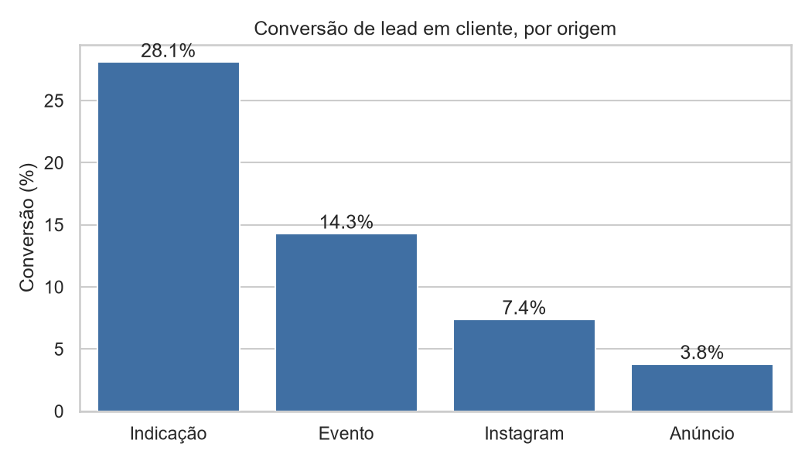
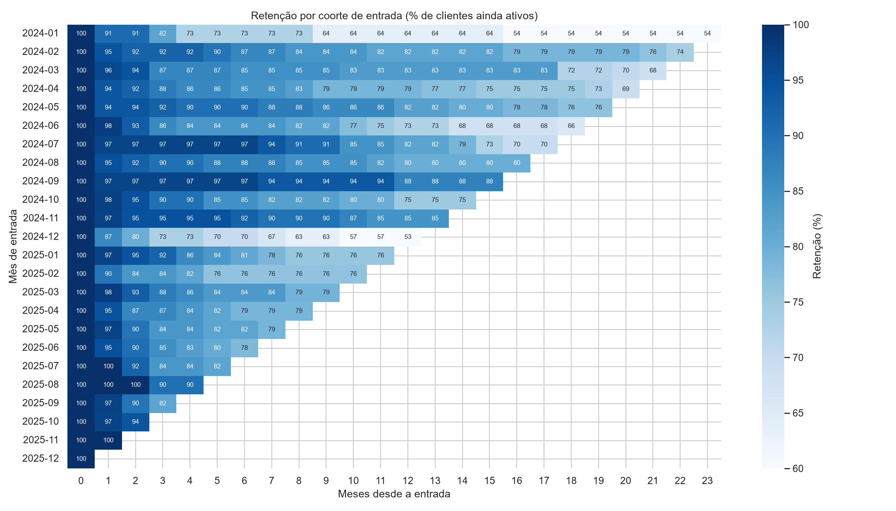
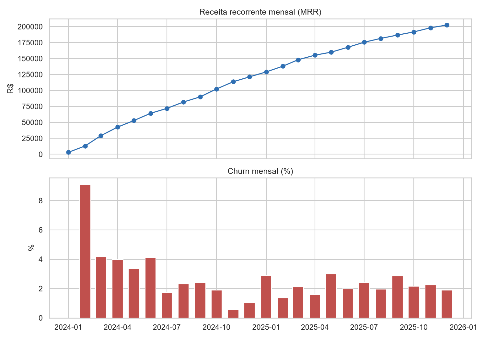

# Funil Comercial e Churn: Análise de uma Assessoria de Investimentos

> Projeto de portfólio com dados **sintéticos** (gerados por script em Python).
> Nenhuma informação real de empresas ou clientes foi utilizada.

## Contexto
Assessoria de investimentos fictícia com 3 equipes e 12 assessores,
que capta clientes por quatro origens: indicação, evento, Instagram e anúncio.

## Problema
A diretoria não sabe quais origens de lead geram clientes que permanecem,
em que etapa o funil trava e quanto da receita recorrente se perde por cancelamento.

## Escopo dos dados
- **Período:** 24 meses (jan/2024 a dez/2025)
- **Volume:** 8.000 leads (+160 duplicados propositais, 8.160 registros), 905 clientes fechados, 198 cancelamentos
- **Conversão geral:** 11,3% (clientes fechados ÷ leads únicos)
- **Tabelas geradas:** assessores (12), leads (8.160), histórico de etapas (28.256), clientes (905), receita mensal (9.808), cancelamentos (198)
- **Fonte:** dados sintéticos com regras de negócio realistas e inconsistências
  controladas (duplicidades, grafias diferentes, datas fora de ordem)

## Regras de negócio da simulação

| Origem | Leads | Conversão base | Ciclo médio de venda |
|---|---|---|---|
| Indicação | 1.400 | 28% | ~20 dias |
| Evento | 1.600 | 13% | ~30 dias |
| Instagram | 2.600 | 7,5% | ~35 dias |
| Anúncio | 2.400 | 4% | ~45 dias |

- Cada assessor tem uma habilidade de conversão diferente, que ajusta a conversão base
- Três planos de mensalidade: Básico (R$ 150), Intermediário (R$ 350) e Premium (R$ 800)
- Churn maior nos 3 primeiros meses de cliente e maior em clientes vindos de anúncio
- Sazonalidade: mais leads no início do ano

## Ferramentas
PostgreSQL · Python (pandas, SQLAlchemy, SciPy, statsmodels, scikit-learn, matplotlib, seaborn) · Power BI

## Perguntas de negócio

| # | Pergunta | Métrica | Decisão que apoia |
|---|---|---|---|
| 1 | Onde o funil perde mais leads? | Conversão etapa a etapa | Onde melhorar o processo |
| 2 | Qual origem converte mais e mais rápido? | Conversão e dias até fechar, por origem | Onde investir em captação |
| 3 | Quais assessores e equipes performam melhor? | Conversão e MRR gerado | Treinamento e distribuição de leads |
| 4 | Quanto da receita recorrente estamos perdendo? | MRR e churn % mensal | Prioridade de retenção |
| 5 | Clientes de quais origens e planos ficam mais tempo? | Retenção por coorte | Qualidade do lead, não só volume |

## Definições das métricas

- **Conversão por etapa:** leads que chegaram à etapa N+1 ÷ leads que chegaram à etapa N
- **Conversão geral:** clientes fechados ÷ leads criados
- **Ciclo de venda:** data de fechamento − data de criação do lead (em dias)
- **MRR:** soma da receita recorrente dos clientes ativos no mês
- **Churn mensal:** clientes cancelados no mês ÷ clientes ativos no início do mês
- **Retenção da coorte:** % dos clientes de um mês de entrada ainda ativos N meses depois

**Etapas do funil:** lead → contato → reunião → proposta → fechado (com "perdido" possível em qualquer etapa)

## Arquitetura dos dados

Os dados passam por três camadas no PostgreSQL:

1. **raw:** CSVs carregados como texto, sem nenhuma alteração
2. **core:** dados limpos e tipados, com chaves primárias e estrangeiras (padronização de origens, remoção de 160 duplicados e sinalização de datas fora de ordem)
3. **analytics:** views que respondem às perguntas de negócio e alimentam o Power BI

## Estrutura do repositório

```
projeto2-funil-comercial/
├── data/        # CSVs gerados (dados sintéticos)
├── docs/        # gráficos, saída da análise e resultado da regressão
├── sql/         # schema, limpeza, checagens de qualidade e views
├── python/      # geração de dados, carga e análise
├── powerbi/     # dashboard (.pbix)
└── README.md
```

## Como reproduzir

1. Criar o ambiente virtual e instalar as dependências:
   `pip install pandas numpy faker sqlalchemy psycopg2-binary python-dotenv matplotlib seaborn scipy statsmodels scikit-learn`
2. Gerar os dados: `python python/gerar_dados.py`
3. Criar o banco `funil_comercial` no PostgreSQL e configurar o arquivo `.env` (`DB_USER`, `DB_PASSWORD`, `DB_HOST`, `DB_PORT`, `DB_NAME`)
4. Carregar os dados brutos: `python python/carga.py`
5. Executar os scripts da pasta `sql/` nesta ordem: `01_schema_core.sql`, `02_limpeza.sql`, `03b_qualidade_resumo.sql` (checagens) e `04_views.sql`
6. Rodar a análise: `python python/analise.py`

## Principais resultados





### Funil e origem dos leads

| Origem | Leads | Clientes | Conversão | Ciclo médio |
|---|---|---|---|---|
| Indicação | 1.400 | 394 | 28,1% | 19,7 dias |
| Evento | 1.600 | 229 | 14,3% | 28,9 dias |
| Instagram | 2.600 | 192 | 7,4% | 35,0 dias |
| Anúncio | 2.400 | 90 | 3,8% | 45,0 dias |

- Leads de indicação convertem cerca de **7,4 vezes mais** que os de anúncio e fecham em menos da metade do tempo.
- O teste qui-quadrado rejeita a independência entre origem e conversão (χ² = 586,4; gl = 3; p < 0,001). O V de Cramér é 0,271, uma associação de moderada a forte.

### Churn (regressão logística)

Amostra de 905 clientes com 198 cancelamentos. Referência: origem Evento e plano Básico.

| Variável | Odds ratio | IC 95% | p-valor |
|---|---|---|---|
| Origem: Anúncio | 1,92 | 1,12 a 3,29 | 0,017 |
| Origem: Indicação | 0,68 | 0,46 a 1,03 | 0,066 |
| Origem: Instagram | 0,84 | 0,52 a 1,35 | 0,463 |
| Plano: Intermediário | 0,97 | 0,68 a 1,38 | 0,866 |
| Plano: Premium | 0,86 | 0,50 a 1,49 | 0,596 |
| Meses de exposição | 1,07 | 1,04 a 1,10 | < 0,001 |

- Clientes captados por **anúncio têm odds de cancelar 92% maiores** que os de evento, controlando por plano e tempo na base.
- Indicação sugere efeito protetor (odds 32% menores), mas sem significância estatística a 5%.
- O plano contratado não explica o cancelamento.
- O tempo na base é o controle mais forte: cada mês a mais eleva as odds de cancelar em cerca de 7%.
- O modelo tem poder preditivo modesto (pseudo R² de McFadden = 0,047; AUC = 0,66).

### Leitura de negócio

Anúncio é a origem com **pior conversão, maior ciclo e maior risco de cancelamento**, enquanto indicação reúne o melhor desempenho em conversão e velocidade. Isso aponta para priorizar programas de indicação, mas a decisão de alocação de orçamento depende do custo de aquisição por canal, que não está na base.

### Limitações

- Dados sintéticos: os resultados validam o método, não o comportamento de um mercado real.
- Apenas 198 cancelamentos: o modelo detecta o efeito grande (anúncio), mas não tem poder para confirmar efeitos menores (indicação, Instagram).
- A exposição ao risco varia entre clientes. Um modelo de sobrevivência (Kaplan-Meier ou regressão de Cox) trataria isso melhor e é a extensão natural.
- Próximo passo: incluir custo por lead e calcular CAC e LTV por origem.

## Status

- [x] Escopo e perguntas de negócio
- [x] Geração de dados sintéticos
- [x] Carga no PostgreSQL (schema `raw`)
- [x] Limpeza e modelagem em SQL
- [x] Análise em Python (coortes, testes estatísticos)
- [x] Principais insights
- [ ] Dashboard no Power BI